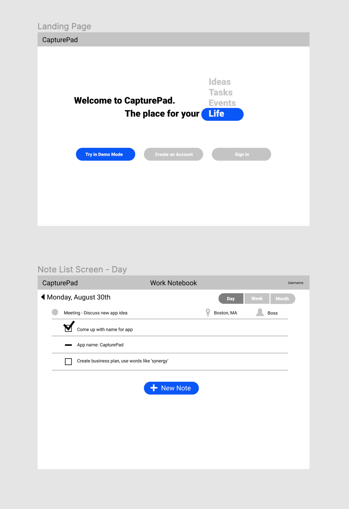

# GAProject3
# CapturePad
By Matt Millheim

Link to App

---

## Introduction and Description
CapturePad is an app where users can jot down events, tasks, and notes that they want to capture. It’s part journal and part todo app. My goal is to allow users to store these items with context and relationships to other items in a way that is searchable and, ultimately, useful for capturing thoughts, the events in their lives, and the important tasks that they want to do, and recalling them later.

I am building this app using Django for the backend and React for the frontend.  

### How to Use the App
This app is still a prototype. New Notebooks can be added and edited, but the app is still a work in progress.

### Design
The app is designed with the intention to allow users to rapidly log events, tasks, and notes as they happen or come to mind. The app supports multiple notebooks so items can be stored in different contexts (e.g. "Work" and "Personal").

---

#### Data Structure:
##### User Model
- Username
- First Name
- Last Name
- Email
- Password
- Notebooks: [Notebook]
- Tags:[Tags]

##### Notebook Model
- Title
- Active
- Owner: User
- Days: [Day]

##### Day Model
- Name
- DayOfWeek
- Notebook: Notebook
- Notes:[Note]

##### Note Model
- TextContent
- Complete
- Images [Image]
- Location
- People: [Person]
- DueDate
- Type: Type
- ChildNotes: [Note]
- Tags: [Tag]
- Context: Context

##### Tag Model
- Name
- Active

##### Person Model
- Name
- e-mail

---

#### MVP:
- full CRUD on notebooks, days, and notes

#### Stretch Goals:
- Add support for drawings
- Add user authorization

### Technologies Used
I used the following technologies to build this app...
- ***React*** for the user interface
- ***Django*** for the backend
- ***Postgres*** for the database

### Wireframes

### Unsolved Problems and Next Steps
At this point the app does not have the ability to add, edit and delete notes. User Authorization also proved to be a challenge. I plan on continuing my work on this app of the coming months.
